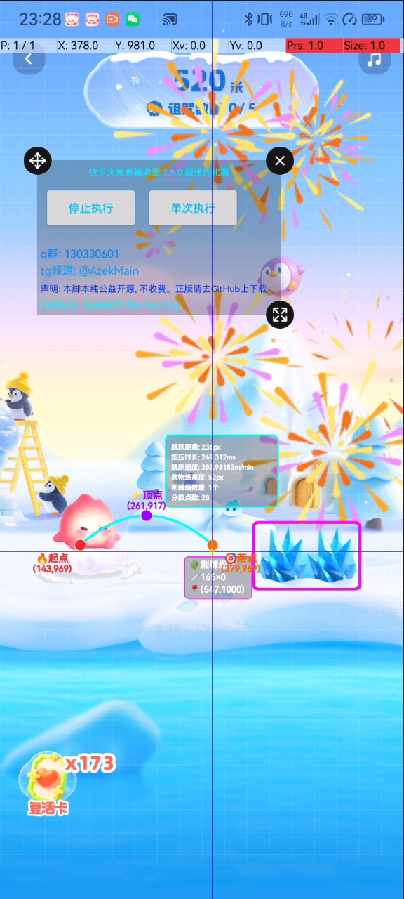

<p align="center">
  
</p>

<h1 align="center"快手火崽崽辅助器</h1>

<p align="center">
  <strong>🎨 一个基于AutoJs Pro, 使用犀牛（Rhino）引擎, Js + xml + 无障碍权限 实现 的 快手火崽崽辅助器</strong>
</p>

<p align="center">
  <strong>主ui使用 Google Material Design3 的 Android 原生ui界面</strong>
</p>

<p align="center">
  
  
  
  
</p>

---

## 📱 预览截图

<p align="center">
  
  
  
  
</p>

---

## ✨ 功能特性
1. 超强的算法，计算障碍位置平均只需 1ms, 并且准确率测试为: 100% ( 前500米 ), 0误差
2. 全分辨率适配，使用了很多算法最终做到了全分辨率适配，每位用户体验到的效果都是一样的
3. 绘制功能，每次识别都会绘制障碍范围矩阵 ( 绘制会加上状态栏高度 ), 还会绘制抛物线, 更加的可视化算法
4. 项目主ui使用: Google Material Design 3 ui，安卓原生ui，适配程度更好
5. 精准计算落地时长，每次跳跃都会使用算法来计算落地时长 ( 平均 0 ms )，可以更快的执行下次跳跃来做到均衡
6. 提供内置算法测试功能，选择图片一键测试 执行算法用时、长按事件 数据
7. 更高的准确率，只要不出现卡顿等情况，几乎可以 100% 识别成功
8. 自动复活功能，采用组件获取等实现自动查找复活按钮并点击该位置
9. 很简洁的ui，没有杂乱组件，没有要调的复杂参数，只有一个打开 脚本悬浮窗 和算法测试功能
10. 具有超强科技感的绘制，超强的可视化，具体可看效果 预览截图/效果展示

---

## 核心功能
 1. **精准荆棘识别**：基于像素颜色分析的荆棘组识别，自定义扫描区域和判定阈值，识别准确率高
 2. **全息科技风绘制**：悬浮窗实时绘制雷达扫描荆棘框、抛物线跳跃轨迹、粒子节点标注、实战数据面板，科技感拉满且不遮挡游戏画面
 3. **智能跳跃计算**：自动计算跳跃落点X坐标、长按屏幕时长，适配不同荆棘间距的跳跃需求
 4. **无人值守运行**：循环执行截图→识别→绘制→跳跃流程，自动检测复活按钮并点击，支持截图权限异常自动提示
 5. **全机型屏幕适配**：内置自定义屏幕适配函数，基准720*1600，适配所有安卓机型的分辨率/屏幕比例
 6. **高鲁棒性防护**：全环节参数校验、异常捕获，截图失败/识别空数据不终止循环，截图资源自动释放避免内存泄漏
 7. **子线程解耦**：绘制、跳跃、复活检测均走独立子线程，不阻塞主循环，脚本运行流畅无卡顿
 
 ## 技术亮点
 1. **像素级视觉识别**：通过RGB颜色值判定荆棘障碍物，自定义扫描步长提升识别效率
 2. **状态机荆棘组解析**：采用状态机模式解析连续荆棘像素，精准划分多个荆棘组的坐标范围
 3. **全息绘制优化**：双层轨迹（能量波+激光虚线）、粒子节点（发射点/顶点/落点）、悬浮数据面板，视觉分层清晰
 4. **资源精细化管理**：截图对象分级创建（原对象/副本），使用后自动`recycle`释放，彻底避免Auto.js bitmap内存泄漏
 5. **循环稳定防护**：三次重复截图检测、权限异常自动提示、全环节`try/catch`，循环执行不卡死、不闪退
 6. **配置化参数设计**：核心游戏参数（玩家占比、荆棘占比、绘制尺寸）集中定义，便于自定义修改
 7. **悬浮窗轻量化绘制**：悬浮窗仅绘制有效轨迹，300ms自动清空残留，不影响游戏视觉体验
 
 # 快速使用
 ### 运行环境
 - 安卓设备（Android 7.0+）
 - Auto.js Pro（建议最新版，需开启**悬浮窗、截图、无障碍**权限）
 ### 操作步骤
 1. 将脚本导入Auto.js Pro，确保所有函数/变量无缺失
 2. 打开快手APP，进入**火崽崽**游戏界面并保持前台运行
 3. 在Auto.js Pro中运行脚本，脚本自动创建绘制悬浮窗
 4. **启动循环执行**：执行`cycleRun.state = 1; cycleRun();`，脚本进入无人值守循环
 5. **停止循环执行**：执行`cycleRun.state = 0;`，脚本停止循环并释放资源
 6. **单次执行测试**：执行`run();`，单次完成截图→识别→绘制→跳跃流程，用于功能测试
 ## 核心函数说明
 ### 1. 屏幕适配相关（`sd`系列）
 内置全机型屏幕适配函数，无需额外引入，基准分辨率720*1600，支持像素/比例双向适配
 - `sd.x(x, w)`/`sd.y(y, h)`：固定像素转当前机型像素
 - `sd.xp(proportion)`/`sd.yp(proportion)`：屏幕比例转当前机型像素
 - `sd.ptx(proportion)`/`sd.pty(proportion)`：屏幕比例转当前机型整数像素
 - `sd.xpps(x)`/`sd.ypps(y)`：当前像素转屏幕比例
 ### 2. 核心业务函数
 | 函数名               | 核心功能                                   | 关键特性                                           |
 |----------------------|--------------------------------------------|----------------------------------------------------|
 | `getThornsData(img)` | 荆棘组识别核心，基于截图解析荆棘坐标       | 像素校验、状态机解析、空值兜底返回数组             |
 | `drawImg(img, data, options)` | 全息科技风绘制核心 | 全机型适配、分层绘制、数据面板、画笔复位           |
 | `ckltEndX(data)`     | 计算跳跃目标落点X坐标                       | 空白区域适配、荆棘间距判断、有效坐标返回           |
 | `ckltJumpToXTime(endX)` | 计算跳跃所需长按屏幕时长                 | 坐标有效性校验、异常时长返回0                       |
 | `jumpToX(endX)`      | 执行自动长按跳跃                           | 子线程执行、长按Y坐标随机偏移、参数校验             |
 | `clickResurgenceButton()` | 自动检测并点击复活按钮                 | 子线程执行、1ms超时快速识别、可点击判断             |
 | `cycleRun()`         | 脚本核心循环执行函数                       | 子线程运行、全环节校验、循环状态管理、权限异常提示 |
 | `run()`              | 脚本单次执行函数                           | 快速测试、单流程执行                               |
 
 ### 3. 悬浮窗绘制相关
- 初始化透明悬浮窗，尺寸铺满屏幕，触摸不可用避免遮挡游戏操作
- `showBitmap`控制绘制内容，画布`onDraw`实时渲染，无数据时自动清空画布
- 画笔默认配置科技风样式：抗锯齿、圆角端点、颜色抖动、描边模式

## 核心配置参数
集中定义于脚本头部，便于根据游戏版本/设备自定义修改，基准分辨率720*1600
```javascript
// 玩家相关比例
let playersXPps = 154.5 / 720;    // 玩家中心X占比
let playersWidthPps = 143 / 720; // 人物宽度占比
// 荆棘相关比例
let thornsCenterYPps = 1000 / 1600; // 荆棘中心Y占比
let thornsWidthPps = 87 / 720;      // 荆棘宽度占比

```


## 🚀 环境要求

| 环境             | 版本要求 |
|----------------|---------|
| **AutoJs Pro** | 9.0+ (推荐 9.3.11) |
| **Android**    | 7.0+ (API 24+) |
| **autoJs 引擎**  | Rhino犀牛引擎 |

---

---

## 📁 项目结构

```
AutoJs-OpenCV-toobox/
├── main.js          # 主入口文件
├── project.json              # 项目配置文件
├── images/                   # 图片资源
│   ├── ic_app_logo.png       # 应用图标
├── js/
|   ├──script.js              # 主要算法脚本
├── res/
    └── layout/               # XML 布局文件
        ├── activity_main.xml       # 主界面布局
        ├── float_window_layout.xml       # 主界面布局
├── temp/*                    # 项目启动时缓存文件，如当前图片
├── ui/
|   ├── uiInit.js                  # ui初始化
|   ├── uiOn.js                    # 处理事件
|   ├── windowOn.js                # 悬浮窗事件处理
```

---

---

## 📚 相关资源

- [Auto.js Pro 官方文档](https://www.wuyunai.com/docs/)
- [Material Design 3 官方指南](https://m3.material.io/)
- [Material Components for Android](https://github.com/material-components/material-components-android)

---

## 🙏 致谢

- [hyb1996/Auto.js](https://github.com/hyb1996/Auto.js)

**许可说明**：
- ✅ 允许商业使用
- ✅ 允许修改分发
- ✅ 允许私人使用
- ⚠️ 需保留版权声明

---
## 👨‍💻 作者

- **Email**: Azek431@163.com
- **QQ**: 2982154038
- **tg官方频道**: @AzekMain
- **tg官方群组**: @AzekGroup
- **QQ交流群**: 130330601
- **QQ频道**: pd67838308

---

<p align="center">
  如果这个项目对你有帮助，请给一个 ⭐ Star 支持一下！
</p>

也可以给我们赞赏a
<p align="center">
  
  
</p>


