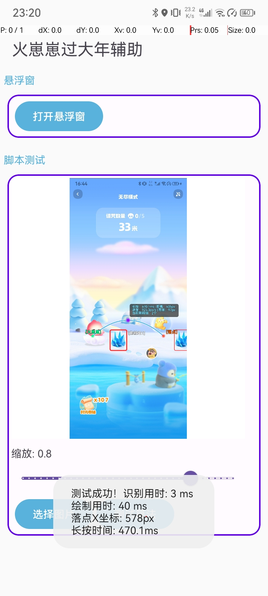
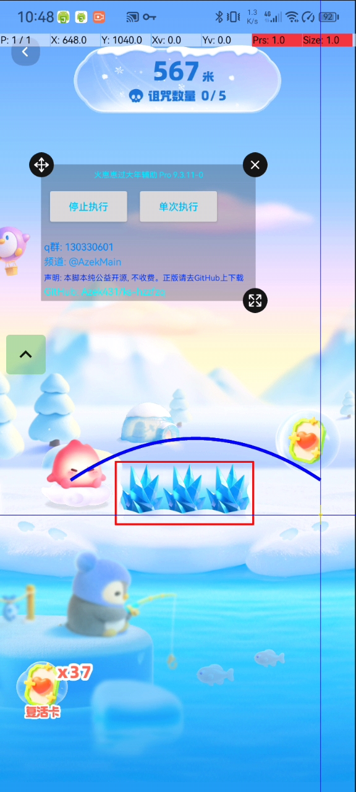

<p align="center">
  
</p>

<h1 align="center"快手火崽崽辅助器</h1>

<p align="center">
  <strong>🎨 一个基于AutoJs Pro, 使用犀牛（Rhino）引擎, Js + xml + 无障碍权限 实现 的 快手火崽崽辅助器</strong>
</p>

<p align="center">
  <strong>主ui使用 Google Material Design3 的 Android 原生ui界面</strong>
</p>

<p align="center">
  
  
  
  
</p>

---

## 📱 预览截图

<p align="center">
  
  
  
</p>

---

## ✨ 功能特性
1. 超强的算法，计算障碍位置平均只需 1ms, 并且准确率测试为: 100% ( 前500米 ), 0误差
2. 全分辨率适配，使用了很多算法最终做到了全分辨率适配，每位用户体验到的效果都是一样的
3. 绘制功能，每次识别都会绘制障碍范围矩阵 ( 绘制会加上状态栏高度 ), 还会绘制抛物线, 更加的可视化算法
4. 项目主ui使用: Google Material Design 3 ui，安卓原生ui，适配程度更好
5. 精准计算落地时长，每次跳跃都会使用算法来计算落地时长 ( 平均 0 ms )，可以更快的执行下次跳跃来做到均衡
6. 提供内置算法测试功能，选择图片一键测试 执行算法用时、长按事件 数据
7. 更高的准确率，只要不出现卡顿等情况，几乎可以 100% 识别成功
8. 自动复活功能，采用组件获取等实现自动查找复活按钮并点击该位置
9. 很简洁的ui，没有杂乱组件，没有要调的复杂参数，只有一个打开 脚本悬浮窗 和算法测试功能

---

## 🚀 环境要求

| 环境             | 版本要求 |
|----------------|---------|
| **AutoJs Pro** | 9.0+ (推荐 9.3.11) |
| **Android**    | 7.0+ (API 24+) |
| **autoJs 引擎**  | Rhino犀牛引擎 |

---

---

## 📁 项目结构

```
AutoJs-OpenCV-toobox/
├── main.js          # 主入口文件
├── project.json              # 项目配置文件
├── images/                   # 图片资源
│   ├── ic_app_logo.png       # 应用图标
├── js/
|   ├──script.js              # 主要算法脚本
├── res/
    └── layout/               # XML 布局文件
        ├── activity_main.xml       # 主界面布局
        ├── float_window_layout.xml       # 主界面布局
├── temp/*                    # 项目启动时缓存文件，如当前图片
├── ui/
|   ├── uiInit.js                  # ui初始化
|   ├── uiOn.js                    # 处理事件
|   ├── windowOn.js                # 悬浮窗事件处理
```

---

---

## 📚 相关资源

- [Auto.js Pro 官方文档](https://www.wuyunai.com/docs/)
- [Material Design 3 官方指南](https://m3.material.io/)
- [Material Components for Android](https://github.com/material-components/material-components-android)

---

## 🙏 致谢

- [hyb1996/Auto.js](https://github.com/hyb1996/Auto.js)

**许可说明**：
- ✅ 允许商业使用
- ✅ 允许修改分发
- ✅ 允许私人使用
- ⚠️ 需保留版权声明

---
## 👨‍💻 作者

- **Email**: Azek431@163.com
- **QQ**: 2982154038
- **tg官方频道**: @AzekMain
- **tg官方群组**: @AzekGroup
- **QQ交流群**: 130330601
- **QQ频道**: pd67838308

---

<p align="center">
  如果这个项目对你有帮助，请给一个 ⭐ Star 支持一下！
</p>

也可以给我们赞赏a
<p align="center">
  
  
</p>


